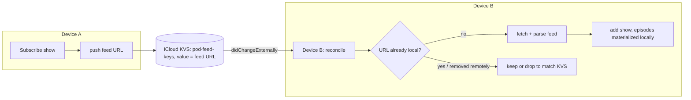

# NerLan — iCloud sync for podcast subscriptions

## Summary

Subscribed podcast shows now follow the user across devices. `PodcastStore`
previously persisted `podcasts.json` only to local Documents and never touched
iCloud, so a show added on the iPhone never appeared on the iPad — even though
favorites, AI content, and listening stats all synced. Subscriptions now mirror
through the same iCloud key-value store the other stores use.

## Approach

Only the **subscription list** travels — one small KVS key per show, value = the
feed URL. Each device fetches and parses the feed itself to materialize episodes:

- **Why URLs, not full feeds.** `CloudKVStore` (NSUbiquitousKeyValueStore) is
  capped at ~1 MB total / 1024 keys, already shared with favorites and AI record
  indexes. A feed's episodes (dozens–hundreds of `EpisodeRecord`s) would blow that
  budget. Syncing just the feed URL keeps each key tiny and lets every device keep
  its own fresh episode list — which is how subscriptions naturally work anyway.

- **One key per show, mirroring `FavoritesStore`.** Each subscription is its own
  `pod-feed-<sha256(url)>` key (hashed so keys stay short and character-safe),
  rather than a single whole-list blob, so concurrent subscribe/unsubscribe on
  different devices don't clobber each other.

- **`reconcile()` is the heart**, run on `enableSync` and on every external KVS
  change (`@objc` handler hopping to the main actor via `Task`, matching
  `AIContentStore`): (1) push any local subscription KVS is missing — so shows
  added while sync was off propagate up and, crucially, so the next step can't
  mistake them for remote deletions; (2) drop local shows whose URL is no longer
  in KVS — a genuine unsubscribe elsewhere; (3) fetch + parse any KVS URL not yet
  local. A feed that fails to download is skipped without removing its KVS key, so
  it's simply retried on the next pass.

- **Eventually consistent, like the rest.** On a fresh device the remote keys may
  not be in the local KVS cache when `enableSync` first runs; the
  `didChangeExternally` notification fires when they arrive and re-runs
  `reconcile`. This is the same model `FavoritesStore` relies on.

- **Hooked into the existing toggle.** `enableSync`/`disableSync` are driven by
  `SettingsStore.syncToICloud` alongside the other stores, and `PodcastStore.init`
  enables sync at launch when the toggle is already on.

## Trade-offs

- **Network on adopt.** Unlike favorites (decoded straight from KVS), adopting a
  podcast requires fetching and parsing the feed, so a show added elsewhere
  appears after a brief network round-trip, not instantly. Acceptable, and it
  keeps episodes current.

- **KVS-authoritative deletes.** A show missing from KVS is removed locally. The
  push-before-drop ordering prevents wrongly deleting local-only subscriptions,
  matching `FavoritesStore`'s authoritative model and its same theoretical
  transient-cache risk.

- **No per-show sync control.** Podcasts ride the single "sync AI content to
  iCloud" toggle rather than getting their own switch — consistent with favorites
  and stats.

- **Downloaded audio still doesn't sync** (by design; large and re-fetchable);
  only the subscription crosses over, and each device downloads on demand.

## Key Files

- `NerLan/Sources/PodcastStore.swift` — KVS prefix + `syncing` flag;
  `enableSync`/`disableSync`; `pushSubscription` on subscribe/add and removal on
  unsubscribe; `reconcile()`; `feedKey` (SHA-256 of the URL); enable at launch.
- `NerLan/Sources/SettingsStore.swift` — toggle now also drives
  `PodcastStore.shared.enableSync()/disableSync()`.
