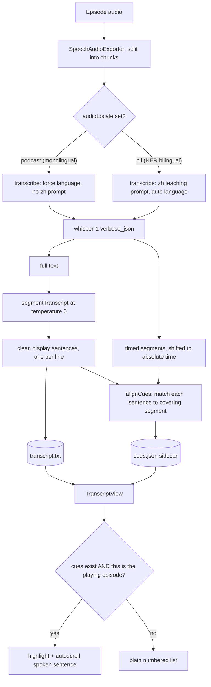

# NerLan — Transcript sentence highlighting (timed cues)

## Summary

The AI transcript screen now karaoke-highlights the sentence currently being
spoken and auto-scrolls it into view, with tap-to-seek. The highlight engages
only when the open transcript belongs to the episode actually playing; older
transcripts (or ones made with a model that returns no timestamps) render
exactly as before, with no highlight.

Two foreign-language fidelity bugs surfaced while building this and were fixed in
the same change: the sentence-segmentation step could translate Korean to
Chinese, and podcasts were being transcribed with a Chinese-teaching prompt that
biased monolingual foreign shows toward Chinese.

## Approach

The pivot question was *where do per-sentence timestamps come from*, given the
existing pipeline stored only plain text. The chosen design ("B3b") keeps the
nice chat-segmented display sentences and maps each one back onto the ASR
timeline:

- **Timestamps require whisper-1.** Only `whisper-1` returns
  `response_format=verbose_json` segment timestamps; the `gpt-4o-transcribe`
  models accept `json`/`text` only. `transcribe` requests `verbose_json` when the
  model supports it (gated by `supportsSegments`) and falls back to plain text
  otherwise, in which case no cues are produced and the screen simply shows no
  highlight. whisper-1 is the app's default transcription model, so this works
  out of the box.

- **Alignment preserves the clean sentences.** The chat re-segmentation only adds
  punctuation and line breaks — it never changes content characters — so each
  display sentence's content (letters/digits, ignoring spaces and punctuation)
  appears in order within the segment stream. `alignCues` walks both monotonically
  and reads each sentence's start time off the segment covering its first content
  character. This is far cheaper than word-level alignment and robust to minor
  ASR/chat drift (a small forward-scan resync per sentence).

- **Chunk offsets.** Long episodes are transcribed in ≤1200 s chunks, each with
  chunk-relative timestamps. A chunk file is normally 0-based, but a trimmed chunk
  can carry a baked-in source-time offset; the code detects which (times already
  near the chunk's absolute position) and lands every segment on the absolute
  episode timeline. Single-chunk episodes — the common case — pass through
  unchanged.

- **Storage is a local sidecar.** Cues live in `Documents/ai/cues/{id}.json`, in
  their own directory so the transcript/handout file enumeration and counts stay
  clean. The `.txt` remains the canonical, synced transcript; cues are an additive
  enhancement. (A follow-up adds iCloud sync for the cue files.)

- **View updates without per-tick churn.** `TranscriptView` reads playback
  position via `.onReceive` and writes the active-sentence index to `@State` only
  when it changes, so `body` re-renders ~once per sentence rather than on every
  0.5 s clock tick — keeping the perf-conscious `List` design intact.

- **Segmentation fidelity (constraint discovered while testing Korean).** The
  punctuate-and-split step ran `gpt-4o` at the default temperature (1.0) with no
  rule against converting foreign scripts. It now runs at `temperature: 0` with an
  explicit top-priority rule to copy Hangul/kana/Latin verbatim and never
  translate or transliterate to Chinese.

- **Podcast locale (constraint discovered while testing foreign podcasts).** The
  RSS parser read `<language>` but discarded the code, mapping it to a Chinese
  display label; every podcast then got the NER Chinese-teaching prompt, biasing a
  monolingual Korean/English show toward Chinese. `EpisodeRecord` gained an
  optional `audioLocale` (ISO-639-1 code, `""` for monolingual-but-unknown, `nil`
  for NER). Podcasts now pass that as whisper's `language` parameter and skip the
  Chinese prompt; NER bilingual programs are untouched.

## Trade-offs

- **whisper-1 vs code-switching.** Forcing whisper-1 to get timestamps reintroduces
  its weakness on the bilingual NER programs (it collapses the foreign examples
  toward the dominant Chinese). The podcast fix sidesteps this for monolingual
  shows, but for NER content the real remedy — transcribe text with
  `gpt-4o-transcribe` and use whisper-1 only for timing — was deferred as a larger
  change.

- **Cues are not retroactive.** Existing transcripts have no timestamps; the user
  must regenerate an episode to gain highlighting. This was an explicit,
  acceptable choice over a migration.

- **Highlight granularity follows ASR segments** (~breath groups), not words, and a
  sentence that whisper split across two segments inherits the first segment's
  time. Good enough for follow-along; word-level was not worth the complexity.

- **Coupling avoided.** Podcast-ness is encoded in the `audioLocale` field rather
  than by sniffing the `pod-` id prefix, keeping transcription logic decoupled
  from the id format.

## Key Files

- `NerLan/Sources/OpenAIService.swift` — `transcribe` returns `TranscriptionResult`
  (text + `[Segment]`); `verbose_json` parsing; `supportsSegments`; `language`
  parameter; `segmentTranscript` hardened (temperature 0 + Hangul rule); `chat`
  gains optional `temperature`.
- `NerLan/Sources/AIContentStore.swift` — cue directory + `transcriptCues`;
  segment collection and absolute-time offsetting in `runTranscript`; `alignCues`
  and `displaySentences`; podcast locale / prompt branching; cue cleanup in
  `delete`/`clearAll`.
- `NerLan/Sources/Models.swift` — `TranscriptCue`; `EpisodeRecord.audioLocale`.
- `NerLan/Sources/PodcastFeedParser.swift` — `localeCode`; fills `audioLocale`.
- `NerLan/Sources/Views/TranscriptView.swift` — highlight + autoscroll + tap-to-seek.
- `NerLan/Sources/Views/AIActions.swift`, `StudyDetailView.swift` — pass
  `episodeId` + `cues`.
